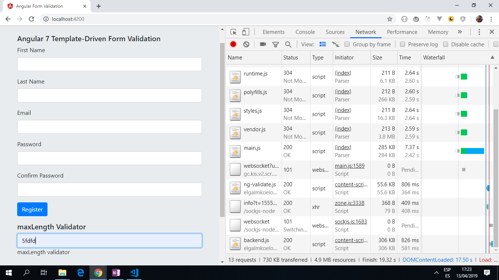

# :zap: Angular Form Validation

* This app sets up form validation in Angular 10 using Template-Driven Forms.
* This is a simple registration form with standard fields for first name, last name, email, password and confirm password. Additional field with maxLength validator added.
* Code from [Blog by Jason Watmore:](http://jasonwatmore.com/post/2018/11/10/angular-7-template-driven-forms-validation-example) - see [:clap: Inspiration](#clap-inspiration) below.
* Not to be upgraded from Angular 10.

*** Note: to open web links in a new window use: _ctrl+click on link_**

## :page_facing_up: Table of contents

* [:zap: Angular Form Validation](#zap-angular-form-validation)
  * [:page_facing_up: Table of contents](#page_facing_up-table-of-contents)
  * [:books: General info](#books-general-info)
  * [:camera: Screenshots](#camera-screenshots)
  * [:signal_strength: Technologies](#signal_strength-technologies)
  * [:floppy_disk: Setup](#floppy_disk-setup)
  * [:computer: Code Examples](#computer-code-examples)
  * [:cool: Features](#cool-features)
  * [:clipboard: Status & To-Do List](#clipboard-status--to-do-list)
  * [:clap: Inspiration](#clap-inspiration)
  * [:file_folder: License](#file_folder-license)
  * [:envelope: Contact](#envelope-contact)

## :books: General info

* Input fields of main form have validation so incorrect inputs trigger a red boundary around the input field and an error message.
* Styling of the template-driven forms is done using Bootstrap.

## :camera: Screenshots

.

## :signal_strength: Technologies

* [Angular v10](https://angular.io/)
* [Bootstrap v4](https://getbootstrap.com/) component library used.

## :floppy_disk: Setup

* Install dependencies using `npm i`.
* Run `ng serve` for a dev server.
* Navigate to `http://localhost:4200/`. The app will automatically reload if you change any of the source files.

## :computer: Code Examples

* div with firstName field entry that is validated using a validator and directive called MustMatch

```typescript
<div class="form-group">
  <label for="firstName">First Name</label>
  <input
    class="form-control"
    name="firstName"
    [(ngModel)]="model.firstName"
    #firstName="ngModel"
    [ngClass]="{ 'is-invalid': f.submitted && firstName.invalid }"
    required
  />
  <div *ngIf="f.submitted && firstName.invalid" class="invalid-feedback ">
    <div *ngIf="firstName?.errors.required">
      First Name is required
    </div>
  </div>
</div>
```

## :cool: Features

* All fields are required, the email field must be a valid email address and the password field must have a min length of 6.
* A custom validator and directive called MustMatch is used to validate that the confirm password and password fields match.
* The form validates on submit rather than as soon as each field is changed, this is implemented using the f.submitted property of the #f="ngForm" template variable which is true after the form is submitted for the first time.

## :clipboard: Status & To-Do List

* Status: Working.
* To-Do: Nothing.

## :clap: Inspiration

* [Blog by Jason Watmore: Angular 7 - Template-Driven Forms Validation Example](http://jasonwatmore.com/post/2018/11/10/angular-7-template-driven-forms-validation-example).

## :file_folder: License

* This project is licensed under the terms of the MIT license.

## :envelope: Contact

* Repo created by [ABateman](https://github.com/AndrewJBateman), email: gomezbateman@yahoo.com
